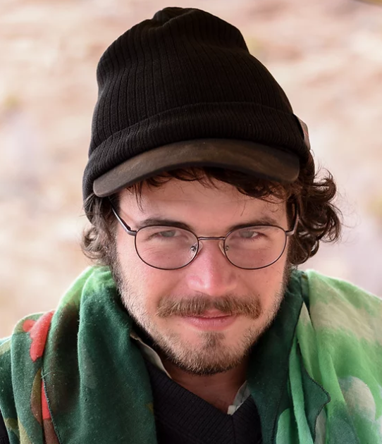

    

       

           

           <h1>Hello!</h1>
           
            
           My name is Rob (he/him)
            
           
                
            

       

    

    

       

        I am a current member of the <a href="https://www2.minneapolismn.gov/government/departments/health/sustainability-homes-environment/sustainability/green-zones/">South Side Green Zone Council</a> and a recent graduate of the University of Minnesota's <a href="https://cla.umn.edu/mgis/about/program-thats-map">Masters of Geographic Information Science (MGIS)</a> program.
                

       <h1><b>Interests</b></h1>
        <ul>
        <li>Environmental Justice</li>
        <li>Education</li>
        <li>Community Geography</li>
        <li> Numerical Spatial Analysis</li>
        <li> Free and Open-Source Software</li>
        </ul>
       

    

--- 

## Bio

I was raised on Mdewakanton and Wahpekute land in the town of Red Wing, Minnesota where I was taught a deep appreciation of our natural world. In 2017, I graduated from the University of Minnesota - Twin Cities with a B.S. in mathematics and have worked in various fields since.

My research interests include: historic and contemporary barriers to racial equity; urban environmental justice; spatio-temporal modeling; and consequences of climate change. I am also passionate about community education and procedural justice in decision making.

In my free time I enjoy paddling, dancing, making music, and writing.
