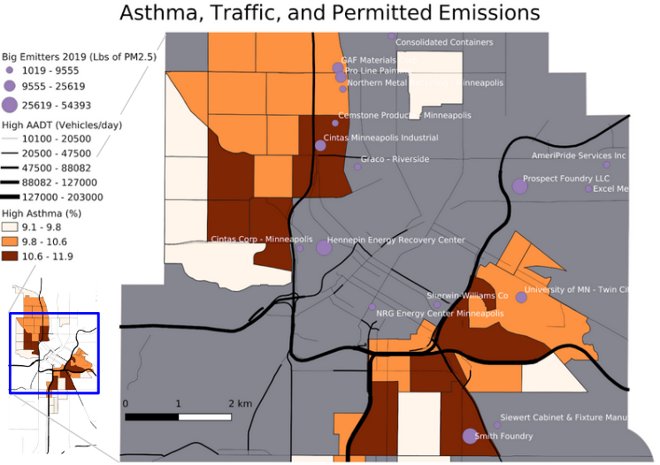
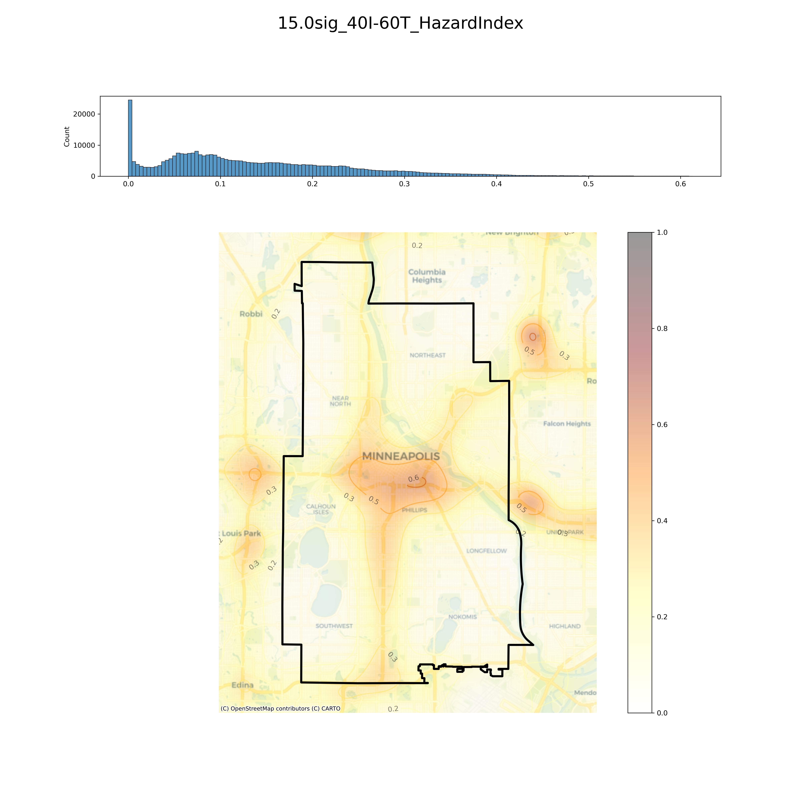
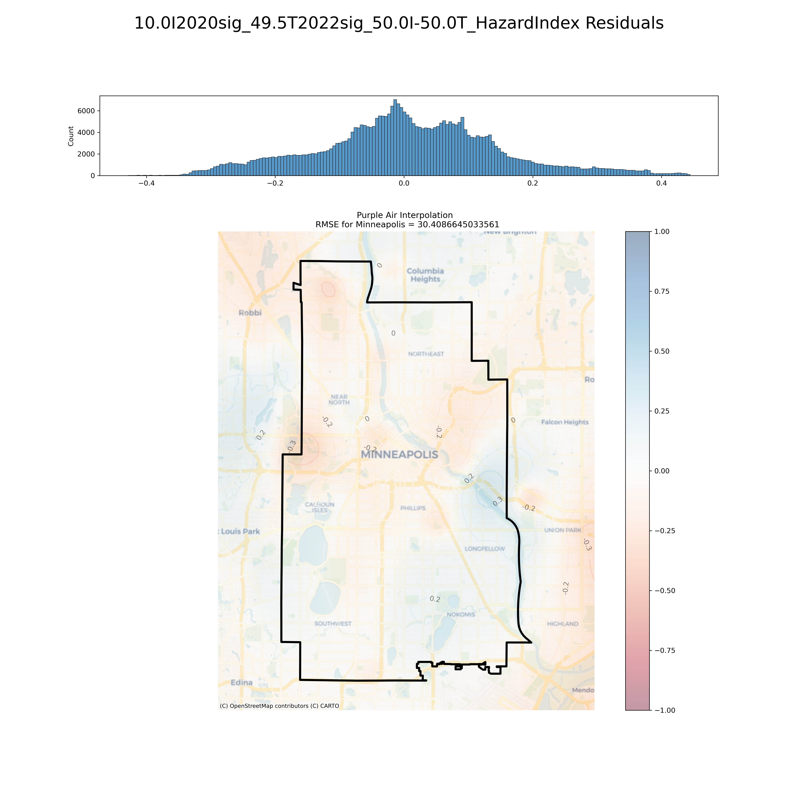
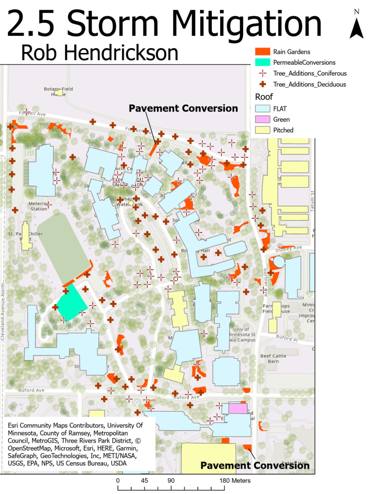

<!-- For Collapible cell formatting - https://developer.mozilla.org/en-US/docs/Web/HTML/Element/details -->

<h1><b>Current Projects</b> <small><small><small><i>(Click to Expand a Project)</i></small></small></small></h1>
<!-- Mapping Green Zones -->

<h2>Mapping Green Zones</h2>

<h3>One Sentence Description</h3>

Create an interactive web site that promotes environmental justice and highlights the characteristics of the protected municipal <a href="https://www2.minneapolismn.gov/government/departments/health/environmental-programs/sustainability/green-zones/">Green Zones</a> in Minneapolis.

<h3> 
<a href="https://rwhendrickson.github.io/MappingGZ/MVP_2" class="btn" style = "color: Blue">Map</a>
<a href="https://github.com/RwHendrickson/MappingGZ" class="btn" style = "color: Blue">Repository</a> 
</h3>

<!-- Env Hazards in Mpls -->

<h2>Measuring the Distribution of Environmental Hazards in Minneapolis</h2>

<h3> 
<a href="https://github.com/RwHendrickson/GIS5571/blob/main/Final_Project" class="btn" style = "color: Blue">Repository</a>
</h3>

<h3><b> Abstract </b></h3>

It is understood that some parts of Minneapolis experience a greater burden of environmental hazard than others. Anecdotally and visually, this can be correlated to <a href="https://legacy.umn.edu/stories/a-city-divided-0">restrictive housing practices</a> of the early to mid 20th century. This project aims to quantify the cumulative environmental harms across Minneapolis at a fine spatial resolution with the intention of spatially correlating this with historic restrictive housing practices and modern demographics.
  

 
<h3> An example of an air quality hazard index </h3>

<h3> Interpolation of 6-Month Average PM2.5 Observations</h3>

<h3> Residuals from Air Quality Hazard Index and Normalized PurpleAir Interpolation</h3>

<h3><b> Data Sources </b></h3>

<h4> <a href="https://files.pca.state.mn.us/pub/file_requests/datasets/Air/">MPCA's Permitted Industrial Emissions</a> </h4>
<h4> <a href="https://gisdata.mn.gov/dataset/trans-aadt-traffic-segments">MnDoT's Annual Average Daily Traffic (AADT)</a> </h4>
<h4> <a href="https://www.cdc.gov/places/index.html">PLACES Asthma Rates</a> </h4>
<h4> <a href="https://map.purpleair.com/1/mAQI/a60/p604800/cC0#11/44.9402/-93.2188">PurpleAir Observed Particulate Matter 2.5 (PM2.5)</a> </h4>

<h1><b>Past Projects</b></h1>
<!-- Mobility -->

<h2>Twin Cities Mobility & Pollutants</h2>

<i> Presented in Denver at the 2023 AAG Conference </i> 

  

(<a href="https://drive.google.com/file/d/1SsGwYA1fzrX8Vt3p-IpZ3X70NN7KwxD6/view?usp=drive_link" target="_blank">Slides</a> | <a href="https://drive.google.com/file/d/1Y3SjIrVOmcSrzCygq_HvVVrLvtGeC03Z/view?usp=drive_link" target="_blank">Recording</a>) 

 

In this project, I worked with <a href="https://cla.umn.edu/about/directory/profile/dizhu">Dr. Di Zhu</a> and the GeoDI lab to explore the scaling relationships between human mobility and pollutants in the Twin Cities Metropolitan Area (TCMA). This involved:
   
<ol>
<li>Cleaning and aggregating large datasets of:</li>
<ul>
 
<li>Device trajectories in the TCMA </li>
<ul><li>Data funded by Center for Urban & Regional Affairs (<a href="https://www.cura.umn.edu/">CURA</a>) </li></ul>
<li>Daily carbon dioxide emissions (<a href="https://www.nature.com/articles/s41597-022-01657-z">Source</a>) </li>
</ul>
 
<li>Measuring human mobility indices at various time scales</li>
 
<li>Exploring relationships between mobility indices and municipal carbon emissions</li>
</ol>

    

       

           
       

    

    

       

             <embed type="text/html" src="../figs/for_website.html" width="400" height="400"/>
       

    

<!-- Mitigating Runoff -->

<h2>Mitigating Runoff on the St. Paul Campus</h2>

The goal of this project was to find the most cost-effective storm-water runoff mitigation strategy for the St. Paul Campus of the University of Minnesota.
   
This involved modeling Rainfall at Surface (RAS) and Surface Absorption (SA) to estimate runoff across the study area as well as approximating flow accumulation using Digital Elevation Model (DEM) data. Upon diagnosing the current condition of the campus’ storm preparedness, mitigation measures were proposed to bring net runoff of each watershed to zero.
   

    
<!--<iframe src="../figs/25mm_Mitigation_map.pdf#toolbar=0" title="25mm Storm Mitigation" width="100%" height="1000px">
</iframe>-->

<!-- Swimmers Itch -->

<h2>Modeling Cercarial Dermatitis</h2>

   
In the summer of 2016, I participated in an undergraduate research experience at the University of Wisconsin – La Crosse. Following their crash course in mathematical ecology, my mentors, <a href="https://www.uwlax.edu/profile/gsandland/">Dr. Greg Sandland</a> and <a href="https://www.uwlax.edu/profile/jpeirce/">Dr. James Peirce</a>, paired me with another undergraduate student, <a href="http://feffermanlab.org/kelly.html">Kelly Buch</a>.
   
Tasked with finding our own research topic, my partner and I scoured countless articles and research papers. We eventually resolved to study cercarial dermatitis, also known as swimmers’ itch, because the control practices at that time were particularly harmful to lake ecosystems. By the end of the summer, we had built our own mathematical model of the parasite-host dynamics and coded a specialized RK4 differential equation solver into Matlab. This allowed us to experiment with more ecologically sound treatment methods and devise recommendations for lake management across the Midwest.
   
We later presented our project at the 2017 Joint Mathematics Meeting in Atlanta, and our preliminary work led to a <a href="https://www.researchgate.net/publication/342077609_A_mathematical_model_for_the_control_of_swimmer%27s_itch">publication</a> in 2020 by Dr. Peirce and Dr. Sandland, in which we are acknowledged.

